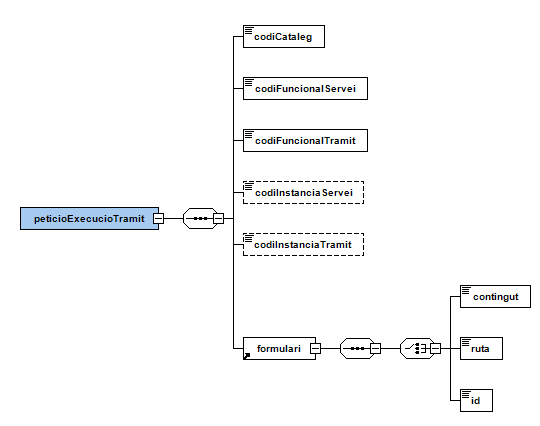
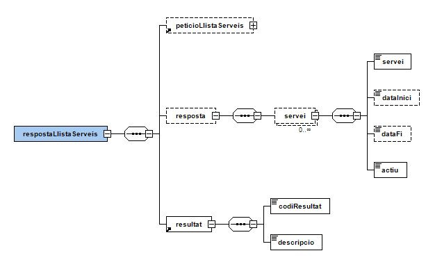
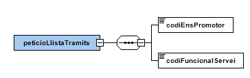
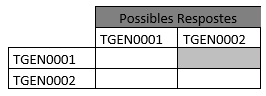

# OVER
Documentació d'integració d'OVER

# Taula de continguts

- [1. Introducció](#1-introducció)
- [2. Transmissions de dades disponibles](#2-Transmissions-de-dades-disponibles)
- [3. Missatgeria del servei](#3-Missatgeria-del-servei)
   * [3.1. Descàrrega de la documentació d'un tràmit (OVER_DOCUMENTACIO)](#31-Descàrrega-de-la-documentació-tràmit-OVER_DOCUMENTACIO)
      - [3.1.1. Petició dades específiques](#311-Petició-dades-específiques)
      - [3.1.2. Resposta dades específiques](#312-Resposta-dades-específiques)
          - [3.1.2.1. Resultat de l’operació](#3121-Resultat-de-la-operació)   
   * [3.2. Obtenció de formulari de tramitació (OVER_FORMULARI)](#32-Obtenció-de-formulari-de-tramitació-OVER_FORMULARI)
      - [3.2.1. Petició dades específiques](#321-Petició-dades-específiques)
      - [3.2.2. Resposta dades específiques](#322-Resposta-dades-específiques)
   * [3.3. Obtenció de context de tramitació (OVER_CONTEXT)](#33-Obtenció-de-context-de-tramitació-OVER_CONTEXT)
      - [3.3.1. Petició dades específiques](#331-Petició-dades-específiques)
      - [3.3.2. Resposta dades específiques](#332-Resposta-dades-específiques)
   * [3.4. Tramitació (OVER_TRAMITACIO)](#34-Tramitació-OVER_TRAMITACIO)
      - [3.4.1. Petició dades específiques](#341-Petició-dades-específiques)
      - [3.4.2. Resposta dades específiques](#342-Resposta-dades-específiques)
   * [3.5. Actualització d'informació d'un tràmit (OVER_ACTUALITZACIO)](#35-Actualització-informació-tràmit-OVER_ACTUALITZACIO)
      - [3.5.1. Petició dades específiques](#351-Petició-dades-específiques)
      - [3.5.2. Resposta dades específiques](#352-Resposta-dades-específiques)
   * [3.6. Consulta de tràmits (OVER_CONSULTA)](#36-Consulta-de-tràmits-OVER_CONSULTA)
      - [3.6.1. Petició dades específiques](#361-Petició-dades-específiques)
      - [3.6.2. Resposta dades específiques](#362-Resposta-dades-específiques)    
   * [3.7. Llista expedients de serveis (OVER_LLISTA_EXPEDIENTS)](#37-Llista-expedients-de-serveis-OVER_LLISTA_EXPEDIENTS)
      - [3.7.1. Petició dades específiques](#371-Petició-dades-específiques)
      - [3.7.2. Resposta dades específiques](#372-Resposta-dades-específiques)           
   * [3.8. Consulta d'expedient (OVER_CONSULTA_EXPEDIENT)](#38-Consulta-expedient-OVER_CONSULTA_EXPEDIENT)
      - [3.8.1. Petició dades específiques](#381-Petició-dades-específiques)
      - [3.8.2. Resposta dades específiques](#382-Resposta-dades-específiques)    
   * [3.9. Llista serveis funcionals (OVER_LLISTA_SERVEIS)](#39-Llista-serveis-funcionals-OVER_LLISTA_SERVEIS)
      - [3.9.1. Petició dades específiques](#391-Petició-dades-específiques)
      - [3.9.2. Resposta dades específiques](#392-Resposta-dades-específiques)    
   * [3.10. Llista tràmits funcionals (OVER_LLISTA_TRAMITS)](#310-Llista-tràmits-funcionals-OVER_LLISTA_TRAMITS)
      - [3.10.1. Petició dades específiques](#3101-Petició-dades-específiques)
      - [3.10.2. Resposta dades específiques](#3102-Resposta-dades-específiques)    
   * [3.11. Integració sense PDF (OVER_INTEGRACIO)](#311-Integració-sense-PDF-OVER_INTEGRACIO)
      - [3.11.1. Petició dades específiques](#3111-Petició-dades-específiques)
      - [3.11.2. Resposta dades específiques](#3112-Resposta-dades-específiques)    
- [4. Exemple integració](#4-Exemple-integració)
   * [4.1. Flux de tramitació](#41-Flux-de-tramitació)
   * [4.2. OVER_INTEGRACIO](#42-OVER_INTEGRACIO)
       - [4.2.1. OVER_FORMULARI](#421-OVER_FORMULARI)
         
# 1. Introducció
Aquest document detalla la missatgeria associada al servei de l'Oficina Virtual d’Emissió i Recepció, en endavant OVER. Per poder realitzar la integració cal conèixer prèviament la següent documentació:
•	Document de Missatgeria Genèrica de la PCI del Consorci AOC.

# 2. Transmissions de dades disponibles
Les dades i operacions disponibles a través del servei són les que es presenten a continuació:

|EMISSOR|
|----|
|Consorci Administració Oberta de Catalunya|

|PRODUCTE | MODALITAT               | DESCRIPCIO|
|----     | ----------              | ----------|
|OVER     | OVER_DOCUMENTACIO       | Operació de descàrrega de documentació associada a un tràmit|
|OVER     | OVER_FORMULARI          | Operació d'obtenció del formulari de tramitació d'un tràmit|
|OVER     |	OVER_CONTEXT            | Operació d'obtenció de les dades de context d’un tràmit|
|OVER     |	OVER_TRAMITACIO         | Operació d'inici d’una instància de tràmit|
|OVER     | OVER_ACTUALITZACIO      | Operació que permet assignar informació a una instància de servei (estat, número d'expedient i altres dades)|
|OVER     |	OVER_CONSULTA           |	Consulta d'instàncies de tràmit a partir d’un rang de dates|
|OVER     | OVER_LLISTA_EXPEDIENTS  | Llista expedients de tramitacions realitzades a partir de paràmetres clau o cerca.|
|OVER     |	OVER_CONSULTA_EXPEDIENT | Consulta les tramitacions i informació relacionada sobre un expedient|
|OVER     |	OVER_LLISTA_SERVEIS     | Llista serveis funcionals a partir d'un catàleg|
|OVER     |	OVER_LLISTA_TRAMITS     | Llista tràmits funcionals a partir d’un catàleg i servei|
|OVER     |	OVER_INTEGRACIO         | Mètode de tramitació mitjançant integració sense necessitat d'omplir i manipular formularis PDF|

# 3. Missatgeria del servei
A continuació es detalla la missatgeria corresponent a les modalitats de consum del producte OVER.

## 3.1. Descàrrega de la documentació tràmit OVER_DOCUMENTACIO
Operació que permet recuperar la documentació generada en el procés de tramitació.

### 3.1.1. Petició dades específiques
<p align="center">

</p>  

### 3.1.2. Resposta dades específiques
<p align="center">

</p>  
<p align="center">

</p>  

#### 3.1.2.1 Resultat de la operació
<p align="center">

</p>  

## 3.2. Obtenció de formulari de tramitació OVER_FORMULARI
Ja no es fa servir, utilitzar per noves integracions la modalitat [OVER_INTEGRACIO](#311-Integració-sense-PDF-OVER_INTEGRACIO)

Permet obtenir d’OVER la informació del formulari de tramitació d’un determinat tràmit (preompliment).

### 3.2.1. Petició dades específiques
<p align="center">

</p>  

### 3.2.2. Resposta dades específiques
<p align="center">

</p>  

## 3.3. Obtenció de context de tramitació OVER_CONTEXT
Ja no es fa servir, utilitzar per noves integracions la modalitat [OVER_INTEGRACIO](#311-Integració-sense-PDF-OVER_INTEGRACIO)

Permet obtenir d’OVER el context de tramitació d’un tràmit pel qual no es vulgui obtenir el PDF de tramitació via la modalitat OVER_FORMULARI.

### 3.3.1. Petició dades específiques
<p align="center">

</p>  

### 3.3.2. Resposta dades específiques
<p align="center">

</p> 

## 3.4. Tramitació OVER_TRAMITACIO
Ja no es fa servir, utilitzar per noves integracions la modalitat [OVER_INTEGRACIO](#311-Integració-sense-PDF-OVER_INTEGRACIO)

Aquesta modalitat permet iniciar un procés de tramitació a OVER.
OVER permet classificar els tràmits que gestiona en dos grans grups:

•	Tràmits inicials: són tràmits que no depenen de cap altre per a executar-se i, per tant, poden ser iniciats en qualsevol moment. Quan s’executen, aquest tràmits creen una instància de servei (fil d’execució / codiInstanciaServei).

•	Tràmits no-inicials: són tràmits que només poden ser executats dins del context d’una instància de servei (fil d’execució / codiInstanciaServei) ja existent. Els tràmits no inicials depenen d’un tràmit previ.
Així, amb aquesta modalitat, es poden executar tant tràmits inicials com tràmits no-inicials. Per aquesta segona opció, cal afegir a la petició d’execució el codi de la instància de servei (codiInstanciaServei).

### 3.4.1. Petició dades específiques
<p align="center">

</p>  

### 3.4.2. Resposta dades específiques
<p align="center">

</p> 

## 3.5. Actualització informació tràmit OVER_ACTUALITZACIO
Permet associar informació a una determinada instància de servei (estat, número d’expedient o qualsevol altra informació que es mostrarà als usuaris).

### 3.5.1. Petició dades específiques
<p align="center">

</p>  

### 3.5.2. Resposta dades específiques
<p align="center">

</p> 

## 3.6. Consulta de tràmits OVER_CONSULTA
Permet consultar els tràmits rebuts i enviats de l’ens que fa la consulta a partir d’un rang de dates.

### 3.6.1. Petició dades específiques
<p align="center">

</p>  

### 3.6.2. Resposta dades específiques
<p align="center">

</p> 
<p align="center">

</p> 

## 3.7. Llista expedients de serveis OVER_LLISTA_EXPEDIENTS
Permet llistar expedients de tramitacions realitzades a partir de paràmetres clau o cerca. Només mostrarà les dades de l’ens autoritzat a la petició.

### 3.7.1. Petició dades específiques
<p align="center">

</p>  

### 3.7.2. Resposta dades específiques
<p align="center">

</p> 


## 3.8. Consulta expedient OVER_CONSULTA_EXPEDIENT
Permet consultar les tramitacions i informació relacionada sobre un expedient. Només mostrarà les dades de l’ens autoritzat a la petició.

### 3.8.1. Petició dades específiques
<p align="center">

</p>  

### 3.8.2. Resposta dades específiques
<p align="center">

</p> 
<p align="center">

</p> 
<p align="center">

</p> 
<p align="center">

</p> 

## 3.9. Llista serveis funcionals OVER_LLISTA_SERVEIS
Permet llistar serveis funcionals a partir d'un catàleg

### 3.9.1. Petició dades específiques
<p align="center">

</p>  

### 3.9.2. Resposta dades específiques
<p align="center">

</p> 

## 3.10. Llista tràmits funcionals OVER_LLISTA_TRAMITS
Permet llistar tràmits funcionals a partir d’un catàleg i servei.

### 3.10.1. Petició dades específiques
<p align="center">

</p>  

### 3.10.2. Resposta dades específiques
<p align="center">

</p> 
<p align="center">

</p> 

## 3.11. Integració sense PDF OVER_INTEGRACIO
Mètode de tramitació mitjançant integració sense necessitat d'omplir i manipular formularis PDF.

### 3.11.1. Petició dades específiques
<p align="center">

</p>  
<p align="center">

</p> 
<p align="center">

</p> 

### 3.11.2. Resposta dades específiques
<p align="center">

</p> 

# 4. Exemple integració
Exemple de com integrar-se amb el servei de tramitació de l’OVER. S’explicarà com utilitzar l’OVER_INTEGRACIO sense necessitat de manipular formularis PDF. Els exemples van orientats a la integració amb la tramesa genèrica (TGEN).
El procés de tramitació via integració està format per la part síncrona (OVER_INTEGRACIÓ) que retornarà de immediat la instància de tràmit i servei; i una part asíncrona que tramitarà el formulari i generarà tota la documentació pertinent, que podreu descarregar a posteriori.

## 4.1. Flux de tramitació
<p align="center">

</p> 

## 4.2. OVER_INTEGRACIO
Permet realitzar la tramitació sense necessitat de descarregar, omplir i manipular formularis PDF. Utilitzant aquesta modalitat obtindreu el context (codi instància tràmit i servei) que permetrà recuperar la documentació generada i relacionada amb el tràmit.

### 4.2.1. OVER_FORMULARI
Omplir la missatgeria definida del bloc [peticioFormulariTramit](#3111-Petició-dades-específiques)

Un tràmit inicial es considera aquell que desencadena la resta del procés interadministratiu. Per exemple, en una subvenció qualsevol, el tràmit inicial és el de la sol·licitud.

Un tràmit NO inicial sempre és la resposta d'un tràmit ja processat. No es pot iniciar mai un tràmit d'aquest, sense fer referència a un predecessor. Per obtenir la informació del predecessor, cal fer una consulta a OVER_CONSULTA.

<p align="center">

</p> 

En el següent quadre es pot veure que només es pot respondre a la TGEN0001 amb una TGEN0002.

<p align="center">

</p> 

<b>Exemple de petició d’un tràmit inicial:</b>

```xml
<DatosEspecificos>
  <peticioFormulariTramit xmlns="http://www.aoc.cat/over">
    <codiCataleg>Codi INE10 de l'ENS promotor (destí)</codiCataleg>
    <codiFuncionalServei>IdServei (per exemple pel servei de la tramesa genèrica seria: TGEN0001)</codiFuncionalServei>
    <codiFuncionalTramit>IdTràmit (per exemple pel tràmit incial de la tramesa genèrica seria: TGEN0001)</codiFuncionalTramit>
    <codiEns>Codi INE10 de l'ENS origen</codiEns>
  </peticioFormulariTramit>
</DatosEspecificos>
```

<b>Exemple de petició d’un tràmit de resposta (tràmit NO inicial):</b>
  
En aquest cas cal indicar el tràmit predecessor ```xml<codiInstanciaTramitPredecessor>``` 
  
```xml
<DatosEspecificos>
  <peticioFormulariTramit xmlns="http://www.aoc.cat/over">
    <codiCataleg>Codi INE10 de l'ENS destí</codiCataleg>
    <codiFuncionalServei>IdServei (per exemple pel servei de la tramesa genèrica seria: TGEN0001)</codiFuncionalServei>
    <codiFuncionalTramit>IdTràmit (per exemple pel tràmit de resposta de la tramesa genèrica seria: TGEN0002)</codiFuncionalTramit>
    <codiInstanciaServei>Codi d'instància del servei / fil d'execució (en cas de tràmits NO inicials)</codiInstanciaServei>
    <codiInstanciaTramitPredecessor>Codi d'instància de tràmit predecessor en cas del resposta a una instància de tràmit prèvia (tràmit NO inicial)</codiInstanciaTramitPredecessor>
    <codiEns>Codi INE10 de l'ENS promotor/origen</codiEns>
  </peticioFormulariTramit>
</DatosEspecificos>
``` 

