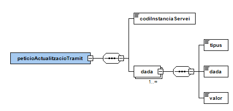
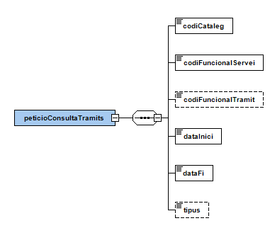
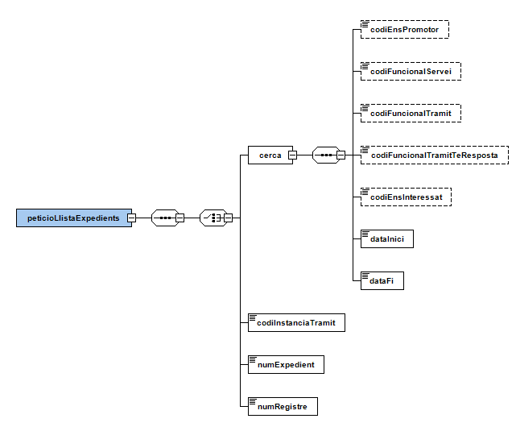
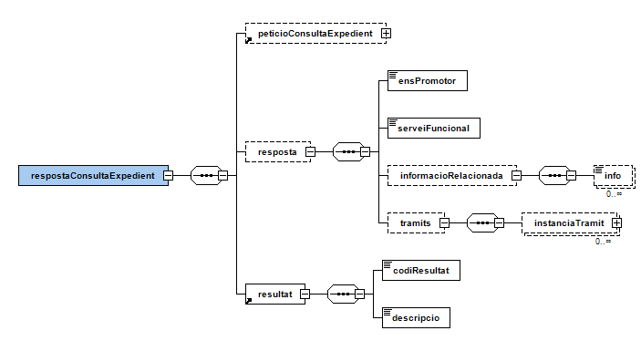

# OVER
Documentació d'integració d'OVER

<b>Control del document</b>

<b>Informació general</b>

|Títol:         |OVER -  Document d’integració del servei|
|----           | ----------              |
|Creat per:     |Departament de Projectes CAOC|
|A revisar per: |Departament de Projectes CAOC|
|A aprovar per: |Departament de Projectes CAOC|


<b>Històric de revisions</b>

|Versió|Data       |Autor          |Comentaris           |
|----  |----       |----           |----                 |
|V1.0	 |12/01/2012	|Projectes CAOC	|Creació del document |  
|V1.1	 |05/11/2012	|Projectes CAOC	|Notificació directa vàlida per trameses amb signatura automàtica i incorporació d’usuari. Suport MTOM en tramitació OVER, descàrrega de documentació d’un tràmit a partir de número d’assentament i consulta de tràmits per rang de dates.|
|V1.2	|23/01/2013	|Projectes CAOC	|NOTIFICACIO_DIRECTA permet informar oficines de registre origen i destí.|
|V1.3	|05/11/2013	|Operacions CAOC	|NOTIFICACIO_DIRECTA permet informar les adreces de correu electrònic a qui es notifica la tramesa.|
|V1.4	|27/02/2014	|Operacions CAOC	|OVER_FORMULARI permet informar XML amb dades de preompliment.|
|V1.5	|08/03/2018	|Suport Tècnic AOC	|Afegim detalls del flux per integracions|
|V2.0	|05/10/2020	|Suport Tècnic AOC	|Revisió canvis URL a nous frontals PCI 3.0|
|V2.1	|08/02/2021	|Suport Tècnic AOC	|Nova missatgeria consulta expedients|
|V2.2	|01/04/2021	|Suport Tècnic AOC	|Nova modalitat OVER_INTEGRACIO|


# Taula de continguts

- [1. Introducció](#1-introducció)
- [2. Transmissions de dades disponibles](#2-Transmissions-de-dades-disponibles)
- [3. Missatgeria del servei](#3-Missatgeria-del-servei)
   * [3.1. Descàrrega de la documentació d'un tràmit (OVER_DOCUMENTACIO)](#31-Descàrrega-de-la-documentació-tràmit-OVER_DOCUMENTACIO)
      - [3.1.1. Petició dades específiques](#311-Petició-dades-específiques)
      - [3.1.2. Resposta dades específiques](#312-Resposta-dades-específiques)
          - [3.1.2.1. Resultat de l’operació](#3121-Resultat-de-la-operació)   
   * [3.2. Obtenció de formulari de tramitació (OVER_FORMULARI)](#32-Obtenció-de-formulari-de-tramitació-OVER_FORMULARI)
      - [3.2.1. Petició dades específiques](#321-Petició-dades-específiques)
      - [3.2.2. Resposta dades específiques](#322-Resposta-dades-específiques)
   * [3.3. Obtenció de context de tramitació (OVER_CONTEXT)](#33-Obtenció-de-context-de-tramitació-OVER_CONTEXT)
      - [3.3.1. Petició dades específiques](#331-Petició-dades-específiques)
      - [3.3.2. Resposta dades específiques](#332-Resposta-dades-específiques)
   * [3.4. Tramitació (OVER_TRAMITACIO)](#34-Tramitació-OVER_TRAMITACIO)
      - [3.4.1. Petició dades específiques](#341-Petició-dades-específiques)
      - [3.4.2. Resposta dades específiques](#342-Resposta-dades-específiques)
   * [3.5. Actualització d'informació d'un tràmit (OVER_ACTUALITZACIO)](#35-Actualització-informació-tràmit-OVER_ACTUALITZACIO)
      - [3.5.1. Petició dades específiques](#351-Petició-dades-específiques)
      - [3.5.2. Resposta dades específiques](#352-Resposta-dades-específiques)
   * [3.6. Consulta de tràmits (OVER_CONSULTA)](#36-Consulta-de-tràmits-OVER_CONSULTA)
      - [3.6.1. Petició dades específiques](#361-Petició-dades-específiques)
      - [3.6.2. Resposta dades específiques](#362-Resposta-dades-específiques)    
   * [3.7. Llista expedients de serveis (OVER_LLISTA_EXPEDIENTS)](#37-Llista-expedients-de-serveis-OVER_LLISTA_EXPEDIENTS)
      - [3.7.1. Petició dades específiques](#371-Petició-dades-específiques)
      - [3.7.2. Resposta dades específiques](#372-Resposta-dades-específiques)           
   * [3.8. Consulta d'expedient (OVER_CONSULTA_EXPEDIENT)](#38-Consulta-expedient-OVER_CONSULTA_EXPEDIENT)
      - [3.8.1. Petició dades específiques](#381-Petició-dades-específiques)
      - [3.8.2. Resposta dades específiques](#382-Resposta-dades-específiques)    
   * [3.9. Llista serveis funcionals (OVER_LLISTA_SERVEIS)](#39-Llista-serveis-funcionals-OVER_LLISTA_SERVEIS)
      - [3.9.1. Petició dades específiques](#391-Petició-dades-específiques)
      - [3.9.2. Resposta dades específiques](#392-Resposta-dades-específiques)    
   * [3.10. Llista tràmits funcionals (OVER_LLISTA_TRAMITS)](#310-Llista-tràmits-funcionals-OVER_LLISTA_TRAMITS)
      - [3.10.1. Petició dades específiques](#3101-Petició-dades-específiques)
      - [3.10.2. Resposta dades específiques](#3102-Resposta-dades-específiques)    
   * [3.11. Integració sense PDF (OVER_INTEGRACIO)](#311-Integració-sense-PDF-OVER_INTEGRACIO)
      - [3.11.1. Petició dades específiques](#3111-Petició-dades-específiques)
      - [3.11.2. Resposta dades específiques](#3112-Resposta-dades-específiques)    
- [4. Exemple integració](#4-Exemple-integració)
   * [4.1. Flux de tramitació](#41-Flux-de-tramitació)
   * [4.2. OVER_INTEGRACIO](#42-OVER_INTEGRACIO)
       - [4.2.1. OVER_FORMULARI](#421-OVER_FORMULARI)
       - [4.2.2. Contingut del formulari](#422-Contingut-del-formualari)
       - [4.2.3. Registre d’entrada / sortida](#423-Registre-entrada-sortida)
       - [4.2.4. Documentació annexa](#424-Documentació-annexa)
   * [4.3. Signatura](#43-Signatura)
   * [4.4. Descàrrega de documentació](#44-Descàrrega-de-documentació)
       - [4.4.1. MUX_DESCARREGA](#441-MUX_DESCARREGA)
       - [4.4.2. OVER_CONSULTA_EXPEDIENT](#442-OVER_CONSULTA_EXPEDIENT)
       - [4.4.3. OVER_DOCUMENTACIO](#443-OVER_DOCUMENTACIO)
   * [4.5. Exemples XML](#45-Exemples-XML)
       - [4.5.1. OVER_INTEGRACIO - Petició](#451-OVER_INTEGRACIO-petició)
       - [4.5.2. OVER_INTEGRACIO - Resposta](#452-OVER_INTEGRACIO-resposta)
       - [4.5.3. MUX_DESCARREGA - Petició](#453-MUX_DESCARREGA-petició)
       - [4.5.4. MUX_DESCARREGA - Resposta](#454-MUX_DESCARREGA-resposta)
       - [4.5.5. OVER_CONSULTA_EXPEDIENT - Petició](#455-OVER_CONSULTA_EXPEDIENT-petició)
       - [4.5.6. OVER_CONSULTA_EXPEDIENT - Resposta](#456-OVER_CONSULTA_EXPEDIENT-resposta)     
       - [4.5.7. OVER_DOCUMENTACIO - Petició](#457-OVER_DOCUMENTACIO-petició)     
       - [4.5.8. OVER_DOCUMENTACIO - Resposta](#458-OVER_DOCUMENTACIO-resposta)                       

# 1. Introducció
Aquest document detalla la missatgeria associada al servei de l'Oficina Virtual d’Emissió i Recepció, en endavant OVER.

Per poder realitzar la integració cal conèixer prèviament la següent documentació:

  •	Document de Missatgeria Genèrica de la PCI del Consorci AOC.

# 2. Transmissions de dades disponibles
Les dades i operacions disponibles a través del servei són les que es presenten a continuació:

|EMISSOR|
|----|
|Consorci Administració Oberta de Catalunya|

|PRODUCTE | MODALITAT               | DESCRIPCIO|
|----     | ----------              | ----------|
|OVER     | OVER_DOCUMENTACIO       | Operació de descàrrega de documentació associada a un tràmit|
|OVER     | OVER_FORMULARI          | Operació d'obtenció del formulari de tramitació d'un tràmit|
|OVER     |	OVER_CONTEXT            | Operació d'obtenció de les dades de context d’un tràmit|
|OVER     |	OVER_TRAMITACIO         | Operació d'inici d’una instància de tràmit|
|OVER     | OVER_ACTUALITZACIO      | Operació que permet assignar informació a una instància de servei (estat, número d'expedient i altres dades)|
|OVER     |	OVER_CONSULTA           |	Consulta d'instàncies de tràmit a partir d’un rang de dates|
|OVER     | OVER_LLISTA_EXPEDIENTS  | Llista expedients de tramitacions realitzades a partir de paràmetres clau o cerca.|
|OVER     |	OVER_CONSULTA_EXPEDIENT | Consulta les tramitacions i informació relacionada sobre un expedient|
|OVER     |	OVER_LLISTA_SERVEIS     | Llista serveis funcionals a partir d'un catàleg|
|OVER     |	OVER_LLISTA_TRAMITS     | Llista tràmits funcionals a partir d’un catàleg i servei|
|OVER     |	OVER_INTEGRACIO         | Mètode de tramitació mitjançant integració sense necessitat d'omplir i manipular formularis PDF|

# 3. Missatgeria del servei
A continuació es detalla la missatgeria corresponent a les modalitats de consum del producte OVER.

## 3.1. Descàrrega de la documentació tràmit OVER_DOCUMENTACIO
Operació que permet recuperar la documentació generada en el procés de tramitació.

### 3.1.1. Petició dades específiques
<p align="center">

</p>  

| Element | Descripció |
| --- | --- |
| peticioDocumentacioTramit/codiInstanciaTramit | Identificador d'instància de tràmit del qual es vol obtenir la informació |
| peticioDocumentacioTramit/numeroAssentament | Número d’assentament de tràmit |
| peticioDocumentacioTramit/dadesTramit | Marcar amb '1' per a obtenir dades detallades del tràmit |

### 3.1.2. Resposta dades específiques
<p align="center">

</p>  

| Element | Descripció |
| --- | --- |
| respostaDocumentacioTramit/peticioDocumentacioTramit | Bloc de dades corresponent a la petició que genera la resposta |
| respostaDocumentacioTramit/resposta/document | Bloc de dades corresponent a un document de tramitació |
| //resposta/document/tipus | Tipus del document: <ul><li>ADJUNT: document adjunt (adjunt al formulari de tramitació)</li><li>ALTRES: altres evidències</li><li>MIS_ORIGINAL: dades MIS associades al formulari del PDF tramitat</li><li>MIS_ACTUALITZAT:  dades MIS actualitzades amb informació obtinguda durant el procés de tramitació</li><li>MUX_EVIDENCIA_ENTRADA: evidència de registre d'entrada</li><li>MUX_EVIDENCIA_SORTIDA: evidència de registre de sortida</li><li>PDF_DESCARREGA: PDF del tràmit descarregat</li><li>PDF_ORIGINAL: PDF del tràmit omplert per l'usuari</li><li>TIQUET: PDF amb el rebut dels registres electrònics</li><li>INT_PETICIO: Petició original si s'ha tramitat via OVER_INTEGRACIO</li><li>XML_DADES: XML de dades del formulari a tramitar</li><li>XML_DADES_SIGNAT: XML de dades signadades (si s'ha tramitat via OVER_INTEGRACIO)</li></ul> |
| //resposta/document/nom | Nom del document en cas d’adjunt |
| //resposta/document/contingut | Document codificat en base64 |
| respostaDocumentacioTramit/resposta/dadesTramit | Bloc de dades corresponent a dades detallades del tràmit |
| //dadesTramit/codiInstanciaServei | Codi d'instància del servei / fil d'execució |
| //dadesTramit/codiInstanciaTramit | Codi d'instància del tràmit |
| //dadesTramit/codiInstanciaTramitPredecessor | Codi d'instància del tràmit predecessor |
| //dadesTramit/dataTramit | Data de tramitació |
| //dadesTramit/codiEnsOrigen | Codi INE10 de l'ens origen |
| //dadesTramit/codiEnsDesti | Codi INE10 de l'ens destí |
| //dadesTramit/nomEnsOrigen | Nom de l'ens origen |
| //dadesTramit/nomEnsDesti | Nom de l'ens destí |
| //dadesTramit/registreSortida | Bloc de dades corresponent a l'assentament de sortida (número i data) |
| //dadesTramit/registreEntrada | Bloc de dades corresponent a l'assentament d'entrada (número i data) |
| //resposta/document/guid | GUID del document que permet la descàrrega via URL de descàrrega (emprat en documents pesats els quals no es poden incrustar en el XML de resposta) |
| respostaDocumentacioTramit/resultat | Bloc que informa del resultat de l'operació. Per més detalls consulteu [3.1.2.1. Resultat de l’operació](#3121-Resultat-de-la-operació) |

#### 3.1.2.1 Resultat de la operació
| Element | Descripció |
| --- | --- |
| //resultat/codiResultat | Codi de resultat (0:operació realitzada correctament, 1: error realitzant la operació) |
| //resultat/descripcio | Descripció del resultat de l'operació |

## 3.2. Obtenció de formulari de tramitació OVER_FORMULARI
Ja no es fa servir, utilitzar per noves integracions la modalitat [OVER_INTEGRACIO](#311-Integració-sense-PDF-OVER_INTEGRACIO)

Permet obtenir d’OVER la informació del formulari de tramitació d’un determinat tràmit (preompliment).

### 3.2.1. Petició dades específiques
<p align="center">

</p>  

### 3.2.2. Resposta dades específiques
<p align="center">

</p>  

## 3.3. Obtenció de context de tramitació OVER_CONTEXT
Ja no es fa servir, utilitzar per noves integracions la modalitat [OVER_INTEGRACIO](#311-Integració-sense-PDF-OVER_INTEGRACIO)

Permet obtenir d’OVER el context de tramitació d’un tràmit pel qual no es vulgui obtenir el PDF de tramitació via la modalitat OVER_FORMULARI.

### 3.3.1. Petició dades específiques
<p align="center">

</p>  

### 3.3.2. Resposta dades específiques
<p align="center">

</p> 

## 3.4. Tramitació OVER_TRAMITACIO
Ja no es fa servir, utilitzar per noves integracions la modalitat [OVER_INTEGRACIO](#311-Integració-sense-PDF-OVER_INTEGRACIO)

Aquesta modalitat permet iniciar un procés de tramitació a OVER.
OVER permet classificar els tràmits que gestiona en dos grans grups:

•	Tràmits inicials: són tràmits que no depenen de cap altre per a executar-se i, per tant, poden ser iniciats en qualsevol moment. Quan s’executen, aquest tràmits creen una instància de servei (fil d’execució / codiInstanciaServei).

•	Tràmits no-inicials: són tràmits que només poden ser executats dins del context d’una instància de servei (fil d’execució / codiInstanciaServei) ja existent. Els tràmits no inicials depenen d’un tràmit previ.
Així, amb aquesta modalitat, es poden executar tant tràmits inicials com tràmits no-inicials. Per aquesta segona opció, cal afegir a la petició d’execució el codi de la instància de servei (codiInstanciaServei).

### 3.4.1. Petició dades específiques
<p align="center">

</p>  

### 3.4.2. Resposta dades específiques
<p align="center">

</p> 

## 3.5. Actualització informació tràmit OVER_ACTUALITZACIO
Permet associar informació a una determinada instància de servei (estat, número d’expedient o qualsevol altra informació que es mostrarà als usuaris).

### 3.5.1. Petició dades específiques
<p align="center">

</p>  

### 3.5.2. Resposta dades específiques
<p align="center">

</p> 

## 3.6. Consulta de tràmits OVER_CONSULTA
Permet consultar els tràmits rebuts i enviats de l’ens que fa la consulta a partir d’un rang de dates.

### 3.6.1. Petició dades específiques
<p align="center">

</p>  

### 3.6.2. Resposta dades específiques
<p align="center">

</p> 
<p align="center">

</p> 

## 3.7. Llista expedients de serveis OVER_LLISTA_EXPEDIENTS
Permet llistar expedients de tramitacions realitzades a partir de paràmetres clau o cerca. Només mostrarà les dades de l’ens autoritzat a la petició.

### 3.7.1. Petició dades específiques
<p align="center">

</p>  

### 3.7.2. Resposta dades específiques
<p align="center">

</p> 


## 3.8. Consulta expedient OVER_CONSULTA_EXPEDIENT
Permet consultar les tramitacions i informació relacionada sobre un expedient. Només mostrarà les dades de l’ens autoritzat a la petició.

### 3.8.1. Petició dades específiques
<p align="center">

</p>  

### 3.8.2. Resposta dades específiques
<p align="center">

</p> 
<p align="center">

</p> 
<p align="center">

</p> 
<p align="center">

</p> 

## 3.9. Llista serveis funcionals OVER_LLISTA_SERVEIS
Permet llistar serveis funcionals a partir d'un catàleg

### 3.9.1. Petició dades específiques
<p align="center">

</p>  

### 3.9.2. Resposta dades específiques
<p align="center">

</p> 

## 3.10. Llista tràmits funcionals OVER_LLISTA_TRAMITS
Permet llistar tràmits funcionals a partir d’un catàleg i servei.

### 3.10.1. Petició dades específiques
<p align="center">

</p>  

### 3.10.2. Resposta dades específiques
<p align="center">

</p> 
<p align="center">

</p> 

## 3.11. Integració sense PDF OVER_INTEGRACIO
Mètode de tramitació mitjançant integració sense necessitat d'omplir i manipular formularis PDF.

### 3.11.1. Petició dades específiques
<p align="center">

</p>  
<p align="center">

</p> 
<p align="center">

</p> 

### 3.11.2. Resposta dades específiques
<p align="center">

</p> 

# 4. Exemple integració
Exemple de com integrar-se amb el servei de tramitació de l’OVER. S’explicarà com utilitzar l’OVER_INTEGRACIO sense necessitat de manipular formularis PDF. Els exemples van orientats a la integració amb la tramesa genèrica (TGEN).

El procés de tramitació via integració està format per la part síncrona (OVER_INTEGRACIÓ) que retornarà de immediat la instància de tràmit i servei; i una part asíncrona que tramitarà el formulari i generarà tota la documentació pertinent, que podreu descarregar a posteriori.


Exemple XML de la [TGEN0001.xml](TGEN0001.xml)

XSD de la TGEN [TGEN0001.xsd](TGEN0001.xsd)


## 4.1. Flux de tramitació
<p align="center">

</p> 

## 4.2. OVER_INTEGRACIO
Permet realitzar la tramitació sense necessitat de descarregar, omplir i manipular formularis PDF. Utilitzant aquesta modalitat obtindreu el context (codi instància tràmit i servei) que permetrà recuperar la documentació generada i relacionada amb el tràmit.

### 4.2.1. OVER_FORMULARI
Omplir la missatgeria definida del bloc [peticioFormulariTramit](#3111-Petició-dades-específiques)

Un tràmit inicial es considera aquell que desencadena la resta del procés interadministratiu. Per exemple, en una subvenció qualsevol, el tràmit inicial és el de la sol·licitud.

Un tràmit NO inicial sempre és la resposta d'un tràmit ja processat. No es pot iniciar mai un tràmit d'aquest, sense fer referència a un predecessor. Per obtenir la informació del predecessor, cal fer una consulta a OVER_CONSULTA.

<p align="center">

</p> 

En el següent quadre es pot veure que només es pot respondre a la TGEN0001 amb una TGEN0002.

<p align="center">

</p> 

<b>Exemple de petició d’un tràmit inicial:</b>

```xml
<DatosEspecificos>
  <peticioFormulariTramit xmlns="http://www.aoc.cat/over">
    <codiCataleg>Codi INE10 de l'ENS promotor (destí)</codiCataleg>
    <codiFuncionalServei>IdServei (per exemple pel servei de la tramesa genèrica seria: TGEN0001)</codiFuncionalServei>
    <codiFuncionalTramit>IdTràmit (per exemple pel tràmit incial de la tramesa genèrica seria: TGEN0001)</codiFuncionalTramit>
    <codiEns>Codi INE10 de l'ENS origen</codiEns>
  </peticioFormulariTramit>
</DatosEspecificos>
```

<b>Exemple de petició d’un tràmit de resposta (tràmit NO inicial):</b>
  
En aquest cas cal indicar el tràmit predecessor ```<codiInstanciaTramitPredecessor>``` 
  
```xml
<DatosEspecificos>
  <peticioFormulariTramit xmlns="http://www.aoc.cat/over">
    <codiCataleg>Codi INE10 de l'ENS destí</codiCataleg>
    <codiFuncionalServei>IdServei (per exemple pel servei de la tramesa genèrica seria: TGEN0001)</codiFuncionalServei>
    <codiFuncionalTramit>IdTràmit (per exemple pel tràmit de resposta de la tramesa genèrica seria: TGEN0002)</codiFuncionalTramit>
    <codiInstanciaServei>Codi d'instància del servei / fil d'execució (en cas de tràmits NO inicials)</codiInstanciaServei>
    <codiInstanciaTramitPredecessor>Codi d'instància de tràmit predecessor en cas del resposta a una instància de tràmit prèvia (tràmit NO inicial)</codiInstanciaTramitPredecessor>
    <codiEns>Codi INE10 de l'ENS promotor/origen</codiEns>
  </peticioFormulariTramit>
</DatosEspecificos>
``` 

### 4.2.2. Contingut del formulari

Dades en format XML que representen el contingut del formulari. Aquestes han de complir l’schema XSD que es proporcionarà per servei i tràmit funcional al que s’integra. Al mateix temps, si el tràmit ho requereix, es faran validacions lògiques sobre les dades, per exemple la validació d’un NIF.

<b>Exemple de contingut del formulari:</b>

```xml
<PAG_DADES_INTEGRACIO xmlns="http://www.aoc.cat/over">
  <TXT_EXPEDIENT>EXP-147F-2021</TXT_EXPEDIENT>
  <COMUNIQUEN>Us comuniquem que en relació ...</COMUNIQUEN>
</PAG_DADES_INTEGRACIO>
```

### 4.2.3. Registre entrada sortida

El procés de tramitació sempre farà un registre d’entrada i un de sortida. En cas de disposar de registre, pots informar-lo i quan aquest es tramiti no es farà un nou registre.

<b>Exemple de registre de sortida i entrada:</b>

```xml
<registreOrigen tipusRegistre="SARCAT">
  <dataRegistre>2017-07-24T00:00:00</dataRegistre>
  <assentamentRegistre>REG_SORT_1234</assentamentRegistre>
  <evidenciaRegistre>PGVudjpFbnZlbG9...</evidenciaRegistre>
</registreOrigen>
<registreDesti tipusRegistre="EACAT">
  <dataRegistre>2017-07-24T23:59:59</dataRegistre>
  <assentamentRegistre>REG_ENT_1234</assentamentRegistre>
  <evidenciaRegistre>PGVudjpFbnZlbG9...</evidenciaRegistre>
</registreDesti>
```

### 4.2.4. Documentació annexa

La documentació que es vulgui annexar a la tramitació, caldrà fer-la via MTOM a la petició del SIRI. Els fitxers enviats es desaran com a documentació annexa.

<p align="center">

</p> 


## 4.3. Signatura

Les dades generades a partir de les dades rebudes es signaran amb el certificat del vostre organisme cedit al Consorci AOC. En cas de no disposar d’aquest certificat o que ja no sigui vàlid, es signarà amb el certificar propi del Consorci AOC.

La signatura que es generarà serà XADES Enveloped amb segell de temps.

## 4.4. Descàrrega de documentació

Una vegada la tramitació s’hagi efectuat, podreu recuperar la documentació generada relacionada amb la tramitació. Els documents que s’obtindran seran:

•	XML_TRAMIT: Les dades que composen el tràmit, generades a partir de les dades rebudes.

•	XML_TRAMIT_SIGNAT: XML_TRAMIT signat amb el certificat cedit.

•	PDF_ORIGINAL: PDF planxat amb les dades rebudes.

•	ADJUNT: Documentació enviada per MTOM.

•	TIQUET: PDF_ORIGINAL + dades rellevants de la tramitació (identificadors, data, registre,...)

Aquesta documentació es pot recuperar per dues vies: MUX_DESCARREGA (requereix OVER_CONSULTA_EXPEDIENT previ) o OVER_DOCUMENTACIO.


### 4.4.1. MUX_DESCARREGA

Requereix com a paràmetre d’entrada el número d’assentament del tràmit generat pel MUX. Aquest es pot cercar via OVER_CONSULTA_EXPEDIENT amb el codi instància servei retornat per OVER_INTEGRACIO.

En cas d’haver informat el registre propi i no haver fet servir MUX, aquesta via no funcionarà i cal fer servir OVER_DOCUMENTACIO.

Si no es troba l’assentament demanat, retornarà la següent resposta:

```xml
<ns0:RespostaRegistre xmlns:ns0="http://net.aocat/MUX2/RespostaRegistre" xmlns:xsi="http://www.w3.org/2001/XMLSchema-instance">
  <ns0:Resultat codi="KO">
    <ns0:Errors>
      <ns0:Error>
        <ns0:Codi>502</ns0:Codi>
        <ns0:Descripcio>No s'ha trobat cap assentament amb número S2021002609</ns0:Descripcio>
      </ns0:Error>
    </ns0:Errors>
  </ns0:Resultat>
</ns0:RespostaRegistre>
```

Si la documentació encara no està disponible, retornarà la següent resposta:

```xml
<ns0:RespostaRegistre xmlns:ns0="http://net.aocat/MUX2/RespostaRegistre" xmlns:xsi="http://www.w3.org/2001/XMLSchema-instance">
  <ns0:Resultat codi="KO">
    <ns0:Errors>
      <ns0:Error>
        <ns0:Codi>502</ns0:Codi>
        <ns0:Descripcio>02311839943 No s'ha trobat cap document amb registre d'entrada ENTRA-2021-2462</ns0:Descripcio>
      </ns0:Error>
    </ns0:Errors>
  </ns0:Resultat>
</ns0:RespostaRegistre>
```

### 4.4.2. OVER_CONSULTA_EXPEDIENT

En cas de no disposar de número d’assentament, cal cercar-lo a partir del codi instància servei retornat per OVER_INTEGRACIO.

Si la documentació encara no està disponible, retornarà la següent resposta:

```xml
<over:respostaConsultaExpedient xmlns:over="http://www.aoc.cat/over">
  <over:resultat>
    <over:codiResultat>0</over:codiResultat>
    <over:descripcio/>
  </over:resultat>
</over:respostaConsultaExpedient>
```


### 4.4.3. OVER_DOCUMENTACIO

Requereix com a paràmetre d’entrada el codi instància tràmit retornat per OVER_INTEGRACIO.

Si la documentació encara no està disponible, retornarà la següent resposta:

```xml
<over:respostaDocumentacioTramit xmlns:over="http://www.aoc.cat/over">
  <over:resultat>
    <over:codiResultat>1</over:codiResultat>
    <over:descripcio>Tràmit 400547 pendent de tramitar-se. Torni a intentar-ho més tard.</over:descripcio>
  </over:resultat>
</over:respostaDocumentacioTramit>
```

## 4.5. Exemples XML


### 4.5.1. OVER_INTEGRACIO petició

```xml
<Peticion>
  <Atributos>
    <IdPeticion>CU1-OVER_INTEGRACIO-1613995900878</IdPeticion>
    <NumElementos>1</NumElementos>
    <TimeStamp/>
    <CodigoCertificado>OVER_INTEGRACIO</CodigoCertificado>
    <CodigoProducto>OVER</CodigoProducto>
    <DatosAutorizacion>
      <IdentificadorSolicitante>800180001</IdentificadorSolicitante>
      <NombreSolicitante>BCN</NombreSolicitante>
      <Finalidad>PROVES</Finalidad>
    </DatosAutorizacion>
    <Funcionario>
      <NombreCompletoFuncionario>Dolores Pardo</NombreCompletoFuncionario>
      <NifFuncionario>40404040D</NifFuncionario>
    </Funcionario>
  </Atributos>
  <Solicitudes>
    <SolicitudTransmision>
      <DatosGenericos>
        <Emisor>
          <NifEmisor>Q0801175A</NifEmisor>
          <NombreEmisor>CAOC</NombreEmisor>
        </Emisor>
        <Solicitante>
          <IdentificadorSolicitante>800180001</IdentificadorSolicitante>
          <NombreSolicitante>BCN</NombreSolicitante>
          <Finalidad>PROVES</Finalidad>
          <Consentimiento>Si</Consentimiento>
        </Solicitante>
        <Transmision>
          <CodigoCertificado>OVER_INTEGRACIO</CodigoCertificado>
          <IdSolicitud>1</IdSolicitud>
        </Transmision>
        <Ficheros>
          <Fichero>
            <NombreFichero>holamon.pdf</NombreFichero>
            <Contenido>cid:annex1</Contenido>
            <Id>annex</Id>
          </Fichero>
        </Ficheros>
      </DatosGenericos>
      <DatosEspecificos>
        <peticioIntegracio xmlns="http://www.aoc.cat/over">
          <peticioFormulariTramit>
            <codiCataleg>9610930008</codiCataleg>
            <codiFuncionalServei>TGEN0001</codiFuncionalServei>
            <codiFuncionalTramit>TGEN0001</codiFuncionalTramit>
            <codiEns>800180001</codiEns>
          </peticioFormulariTramit>
          <dadesContingut>
            <formulari>
              <![CDATA[
<PAG_DADES_INTEGRACIO xmlns="http://www.aoc.cat/over">
  <TXT_EXPEDIENT>EXP-482G-2021</TXT_EXPEDIENT>
  <TXT_ASSUMPTE>Assumpte ABC ob</TXT_ASSUMPTE>
  <EXPOSO>Exposo ABC ob</EXPOSO>
  <SOLLICITO>Sol·licito ABC opt</SOLLICITO>
  <TIPUS_TRAMESA>
    <TIPUS>DOCUMENTACIO_REGISTRADA_DESTINADA_A_ALTRES_AAPP</TIPUS>
    <DOCUMENTACIO_REGISTRADA_DESTINADA_A_ALTRES_AAPP>
      <ASSENTAMENT>
        <DATA_HORA_ASSENTAMENT>2020-12-30T22:59:00.000Z</DATA_HORA_ASSENTAMENT>
        <NUM_ASSENTAMENT>REG_SORT_1234</NUM_ASSENTAMENT>
      </ASSENTAMENT>
      <DADES_INTERESSAT>
        <PERSONA_FISICA>
          <NOM>Pere</NOM>
          <PRIMER_COGNOM>Pi</PRIMER_COGNOM>
          <SEGON_COGNOM>Puig</SEGON_COGNOM>
          <DOCUMENT_NIF>
            <DOCUMENT>40404040D</DOCUMENT>
          </DOCUMENT_NIF>
          <PERSONA_DADES_COMPLEMENTARIES>
            <CANAL_PREFERENT_NOTIFICACIO>
<ADRECA_ELECTRONICA_HABILITADA>perepi@mail.cat</ADRECA_ELECTRONICA_HABILITADA>
            </CANAL_PREFERENT_NOTIFICACIO>
            <FORA_CATALUNYA>NO</FORA_CATALUNYA>
            <TELEFON_CONTACTE>935558744</TELEFON_CONTACTE>
<CORREU_ELECTRONIC_CONTACTE>contacte@correo.org</CORREU_ELECTRONIC_CONTACTE>
            <OBSERVACIONS>Sense cap observació</OBSERVACIONS>
          </PERSONA_DADES_COMPLEMENTARIES>
        </PERSONA_FISICA>
      </DADES_INTERESSAT>
      <DADES_REPRESENTAT>
        <PERSONA_JURIDICA_ORGANISME>
          <RAO_SOCIAL>Consorci Administració Oberta de Catalunya</RAO_SOCIAL>
          <DOCUMENT_NIF>
            <DOCUMENT>Q0801175A</DOCUMENT>
          </DOCUMENT_NIF>
          <PERSONA_DADES_COMPLEMENTARIES>
            <CANAL_PREFERENT_NOTIFICACIO>
              <ADRECA_POSTAL>
                <CODI_POSTAL>08018</CODI_POSTAL>
                <ADRECA>Carrer de Tànger, 98, bajo, 08018 Barcelona, B</ADRECA>
              </ADRECA_POSTAL>
            </CANAL_PREFERENT_NOTIFICACIO>
            <FORA_CATALUNYA>NO</FORA_CATALUNYA>
            <TELEFON_CONTACTE>932 72 40 00</TELEFON_CONTACTE>
<CORREU_ELECTRONIC_CONTACTE>info@aocat.net</CORREU_ELECTRONIC_CONTACTE>
            <OBSERVACIONS>El objetivo del consorcio aoc es impulsar la transformación digital de las administraciones catalanas para conseguir gobiernos abiertos, eficientes y transparentes.</OBSERVACIONS>
          </PERSONA_DADES_COMPLEMENTARIES>
        </PERSONA_JURIDICA_ORGANISME>
      </DADES_REPRESENTAT>
    </DOCUMENTACIO_REGISTRADA_DESTINADA_A_ALTRES_AAPP>
  </TIPUS_TRAMESA>
  <INFORMACIO_COMPLEMENTARIA>
    <REFERENCIA_EXTERNA>Es tracta d'un camp de contingut lliure</REFERENCIA_EXTERNA>
    <OBSERVACIONS>L'objectiu d'aquesta obra és observar una sèrie de fenòmens lingüístics del català actual</OBSERVACIONS>
    <DOCUMENTACIO_ADJUNTA>SENSE_DOCUMENTACIO_ADJUNTA</DOCUMENTACIO_ADJUNTA>
  </INFORMACIO_COMPLEMENTARIA>
  <DOCUMENTACIO_FORMAT_ELECTRONIC_URL_DESCARREGA>
    <DOCUMENTACIO>
      <URL>http://admin3-pre.app.aoc.cat/over2-webadmin/detallInstanciaTramit.do?id=115681</URL>
      <OBSERVACIONS>Instància del tràmit</OBSERVACIONS>
    </DOCUMENTACIO>
    <DOCUMENTACIO>
      <URL>http://admin3-pre.app.aoc.cat/over2-webadmin/instanciaTramits.do?opId=filter&amp;filExecucio=100409</URL>
      <OBSERVACIONS>Instància del servei</OBSERVACIONS>
    </DOCUMENTACIO>
  </DOCUMENTACIO_FORMAT_ELECTRONIC_URL_DESCARREGA>
  <DOCUMENTACIO_POSTERIORI_NO_DIGITALITZABLE>
    <DESCRIPCIO_DOCUMENTACIO>Catàleg del Centre de documentació de l'ICD, integrat dins el Catàleg de Biblioteques Especialitzades de la Generalitat (BEG)</DESCRIPCIO_DOCUMENTACIO>
  </DOCUMENTACIO_POSTERIORI_NO_DIGITALITZABLE>
</PAG_DADES_INTEGRACIO>
                              ]]>
            </formulari>
          </dadesContingut>
        </peticioIntegracio>
      </DatosEspecificos>
    </SolicitudTransmision>
  </Solicitudes>
</Peticion>
```


### 4.5.2. OVER_INTEGRACIO resposta

```xml
<over:respostaIntegracio xmlns:over="http://www.aoc.cat/over">
  <over:peticioIntegracio>
    <over:peticioFormulariTramit>
      <over:codiCataleg>9610930008</over:codiCataleg>
      <over:codiFuncionalServei>TGEN0001</over:codiFuncionalServei>
      <over:codiFuncionalTramit>TGEN0001</over:codiFuncionalTramit>
      <over:codiEns>800180001</over:codiEns>
    </over:peticioFormulariTramit>
    <over:dadesContingut>
      <over:formulari>
        <![CDATA[<...>]]>
      </over:formulari>
    </over:dadesContingut>
  </over:peticioIntegracio>
  <over:resposta>
    <over:codiInstanciaServei>437014</over:codiInstanciaServei>
    <over:codiInstanciaTramit>400547</over:codiInstanciaTramit>
  </over:resposta>
</over:respostaIntegracio>
```

### 4.5.3. MUX_DESCARREGA petició

```xml
<Peticion xmlns="http://gencat.net/scsp/esquemes/peticion">
  <Atributos>
    <IdPeticion>CU1-MUX_DESCARREGA</IdPeticion>
    <NumElementos>1</NumElementos>
    <TimeStamp>2021-03-31 16:17:00</TimeStamp>
    <CodigoCertificado>MUX_DESCARREGA</CodigoCertificado>
    <CodigoProducto>MUX</CodigoProducto>
    <DatosAutorizacion>
      <IdentificadorSolicitante>800180001</IdentificadorSolicitante>
      <NombreSolicitante>BCN</NombreSolicitante>
      <Finalidad>PROVES</Finalidad>
    </DatosAutorizacion>
    <Emisor>
      <NifEmisor>Q0801175A</NifEmisor>
      <NombreEmisor>CAOC</NombreEmisor>
    </Emisor>
  </Atributos>
  <Solicitudes>
    <SolicitudTransmision xmlns:pet="http://gencat.net/scsp/esquemes/peticion">
      <DatosGenericos>
        <Emisor>
          <NifEmisor>Q0801175A</NifEmisor>
          <NombreEmisor>CAOC</NombreEmisor>
        </Emisor>
        <Solicitante>
          <IdentificadorSolicitante>800180001</IdentificadorSolicitante>
          <NombreSolicitante>BCN</NombreSolicitante>
          <Finalidad>PROVES</Finalidad>
          <Consentimiento>Si</Consentimiento>
        </Solicitante>
        <Transmision>
          <CodigoCertificado>MUX_DESCARREGA</CodigoCertificado>
          <IdSolicitud>1</IdSolicitud>
        </Transmision>
      </DatosGenericos>
      <DatosEspecificos>
        <PeticioRegistre xmlns="http://net.aocat/MUX2/PeticioRegistre" IdAplicacio="OVER">
          <DescarregaDocumentacio>
            <NumeroAssentamentSortida>S/000040-2021</NumeroAssentamentSortida>
          </DescarregaDocumentacio>
        </PeticioRegistre>
      </DatosEspecificos>
    </SolicitudTransmision>
  </Solicitudes>
</Peticion>
```

### 4.5.4. MUX_DESCARREGA resposta

```xml
<ns0:RespostaRegistre idTransaccio="CU1-MUX_DESCARREGA" xmlns:ns0="http://net.aocat/MUX2/RespostaRegistre">
  <ns0:Resultat codi="OK"/>
  <ns0:DocumentacioAssentament>
    <ns0:NumeroAssentamentSortida>S/000040-2021</ns0:NumeroAssentamentSortida>
    <ns0:Document>
      <ns0:Nom>S/000040-2021 formulari.pdf</ns0:Nom>
      <ns0:Descripcio>PDF_ORIGINAL</ns0:Descripcio>
      <ns0:GUID>6a3c0820-b066-4962-b594-f51596772a14</ns0:GUID>
      <ns0:UUID>eacat-6a3c0820-b066-4962-b594-f51596772a14</ns0:UUID>
    </ns0:Document>
    <ns0:Document>
      <ns0:Nom>S/000040-2021 holamon.pdf</ns0:Nom>
      <ns0:Descripcio>ADJUNT</ns0:Descripcio>
      <ns0:GUID>6202a943-9f48-413b-93ca-c00ede00dfad</ns0:GUID>
      <ns0:UUID>eacat-6202a943-9f48-413b-93ca-c00ede00dfad</ns0:UUID>
    </ns0:Document>
    <ns0:Document>
      <ns0:Nom>S/000040-2021 justificant.pdf</ns0:Nom>
      <ns0:Descripcio>TIQUET</ns0:Descripcio>
      <ns0:GUID>b6b9cc7f-9a1e-4e6c-91b3-e4dc7f24a110</ns0:GUID>
      <ns0:UUID>eacat-b6b9cc7f-9a1e-4e6c-91b3-e4dc7f24a110</ns0:UUID>
    </ns0:Document>
    <ns0:Document>
      <ns0:Nom>S/000040-2021 tramit.xml</ns0:Nom>
      <ns0:Descripcio>XML_TRAMIT</ns0:Descripcio>
      <ns0:GUID>17d0d1d4-665a-432b-8b72-a74aceb507ee</ns0:GUID>
      <ns0:UUID>eacat-17d0d1d4-665a-432b-8b72-a74aceb507ee</ns0:UUID>
    </ns0:Document>
    <ns0:Document>
      <ns0:Nom>S/000040-2021 tramit_signat.xml</ns0:Nom>
      <ns0:Descripcio>XML_TRAMIT_SIGNAT</ns0:Descripcio>
      <ns0:GUID>24a4527f-02ae-4607-9174-0c1932dff0b5</ns0:GUID>
      <ns0:UUID>eacat-24a4527f-02ae-4607-9174-0c1932dff0b5</ns0:UUID>
    </ns0:Document>
  </ns0:DocumentacioAssentament>
</ns0:RespostaRegistre>
```

### 4.5.5. OVER_CONSULTA_EXPEDIENT petició

```xml
<Peticion xmlns="http://gencat.net/scsp/esquemes/peticion">
  <Atributos>
    <IdPeticion>CU1-OVER_CONSULTA_EXPEDIENT</IdPeticion>
    <NumElementos>1</NumElementos>
    <TimeStamp/>
    <CodigoCertificado>OVER_CONSULTA_EXPEDIENT</CodigoCertificado>
    <CodigoProducto>OVER</CodigoProducto>
    <DatosAutorizacion>
      <IdentificadorSolicitante>800180001</IdentificadorSolicitante>
      <NombreSolicitante>BCN</NombreSolicitante>
      <Finalidad>PROVES</Finalidad>
    </DatosAutorizacion>
    <Emisor>
      <NifEmisor>Q0801175A</NifEmisor>
      <NombreEmisor>CAOC</NombreEmisor>
    </Emisor>
  </Atributos>
  <Solicitudes>
    <SolicitudTransmision>
      <DatosGenericos>
        <Emisor>
          <NifEmisor>Q0801175A</NifEmisor>
          <NombreEmisor>CAOC</NombreEmisor>
        </Emisor>
        <Solicitante>
          <IdentificadorSolicitante>800180001</IdentificadorSolicitante>
          <NombreSolicitante>BCN</NombreSolicitante>
          <Finalidad>PROVES</Finalidad>
          <Consentimiento>Si</Consentimiento>
        </Solicitante>
        <Transmision>
          <CodigoCertificado>OVER_CONSULTA_EXPEDIENT</CodigoCertificado>
          <IdSolicitud>1</IdSolicitud>
        </Transmision>
      </DatosGenericos>
      <DatosEspecificos>
        <peticioConsultaExpedient xmlns="http://www.aoc.cat/over">
          <codiInstanciaServei>437014</codiInstanciaServei>
        </peticioConsultaExpedient>
      </DatosEspecificos>
    </SolicitudTransmision>
  </Solicitudes>
</Peticion>
```

### 4.5.6. OVER_CONSULTA_EXPEDIENT resposta

```xml
<over:respostaConsultaExpedient xmlns:over="http://www.aoc.cat/over">
  <over:peticioConsultaExpedient>
    <over:codiInstanciaServei>437014</over:codiInstanciaServei>
  </over:peticioConsultaExpedient>
  <over:resposta>
    <over:ensPromotor ine10="9610930008">Departament de Territori i Sostenibilitat</over:ensPromotor>
    <over:serveiFuncional codi="TGEN0001">Tramesa genèrica</over:serveiFuncional>
    <over:tramits>
      <over:instanciaTramit>
        <over:codiInstanciaTramit>400547</over:codiInstanciaTramit>
        <over:tramitFuncional codi="TGEN0001">Tramesa genèrica</over:tramitFuncional>
        <over:observacions>Assumpte ABC ob</over:observacions>
        <over:data>2021-03-31T13:01:07.000+02:00</over:data>
        <over:ensOrigen ine10="800180001">Ajuntament d'Abrera</over:ensOrigen>
        <over:ensDesti ine10="9610930008">Departament de Territori i Sostenibilitat</over:ensDesti>
        <over:registreSortida>
          <over:numero>S/000040-2021</over:numero>
          <over:data>2021-03-31T13:01:24.000+02:00</over:data>
        </over:registreSortida>
        <over:registreEntrada>
          <over:numero>9033/70/2021</over:numero>
          <over:data>2021-03-31T13:01:04.000+02:00</over:data>
        </over:registreEntrada>
      </over:instanciaTramit>
    </over:tramits>
  </over:resposta>
  <over:resultat>
    <over:codiResultat>0</over:codiResultat>
    <over:descripcio/>
  </over:resultat>
</over:respostaConsultaExpedient>
```

### 4.5.7. OVER_DOCUMENTACIO petició

```xml
<Peticion xmlns="http://gencat.net/scsp/esquemes/peticion">
  <Atributos>
    <IdPeticion>CU1-OVER_DOCUMENTACIO</IdPeticion>
    <NumElementos>1</NumElementos>
    <TimeStamp/>
    <CodigoCertificado>OVER_DOCUMENTACIO</CodigoCertificado>
    <CodigoProducto>OVER</CodigoProducto>
    <DatosAutorizacion>
      <IdentificadorSolicitante>800180001</IdentificadorSolicitante>
      <NombreSolicitante>BCN</NombreSolicitante>
      <Finalidad>PROVES</Finalidad>
    </DatosAutorizacion>
    <Funcionario>
      <NombreCompletoFuncionario>FUNCIONARIO</NombreCompletoFuncionario>
      <NifFuncionario/>
      <EMailFuncionario/>
    </Funcionario>
  </Atributos>
  <Solicitudes>
    <SolicitudTransmision>
      <DatosGenericos>
        <Emisor>
          <NifEmisor>Q0801175A</NifEmisor>
          <NombreEmisor>CAOC</NombreEmisor>
        </Emisor>
        <Solicitante>
          <IdentificadorSolicitante>800180001</IdentificadorSolicitante>
          <NombreSolicitante>BCN</NombreSolicitante>
          <Finalidad>PROVES</Finalidad>
          <Consentimiento>Si</Consentimiento>
        </Solicitante>
        <Transmision>
          <CodigoCertificado>OVER_DOCUMENTACIO</CodigoCertificado>
          <IdSolicitud>1</IdSolicitud>
        </Transmision>
      </DatosGenericos>
      <DatosEspecificos>
        <peticioDocumentacioTramit xmlns="http://www.aoc.cat/over">
          <codiInstanciaTramit>400547</codiInstanciaTramit>
        </peticioDocumentacioTramit>
      </DatosEspecificos>
    </SolicitudTransmision>
  </Solicitudes>
</Peticion>
```

### 4.5.8. OVER_DOCUMENTACIO resposta

```xml
<over:respostaDocumentacioTramit xmlns:over="http://www.aoc.cat/over">
  <over:resposta>
    <over:document>
      <over:tipus>PDF_ORIGINAL</over:tipus>
      <over:contingut>JVBERi0xLjcNJeLjz9MNC...</over:contingut>
    </over:document>
    <over:document>
      <over:tipus>ADJUNT</over:tipus>
      <over:nom>holamon.pdf</over:nom>
      <over:guid>6202a943-9f48-413b-93ca-c00ede00dfad</over:guid>
    </over:document>
    <over:document>
      <over:tipus>TIQUET</over:tipus>
      <over:guid>b6b9cc7f-9a1e-4e6c-91b3-e4dc7f24a110</over:guid>
    </over:document>
    <over:document>
      <over:tipus>XML_TRAMIT</over:tipus>
      <over:contingut>PD94bWwgdmVyc2lvbj0i...</over:contingut>
    </over:document>
    <over:document>
      <over:tipus>XML_TRAMIT_SIGNAT</over:tipus>
      <over:contingut>PGZvcm0xIElkPSJJZDEx...</over:contingut>
    </over:document>
  </over:resposta>
  <over:resultat>
    <over:codiResultat>0</over:codiResultat>
    <over:descripcio/>
  </over:resultat>
</over:respostaDocumentacioTramit>
```
