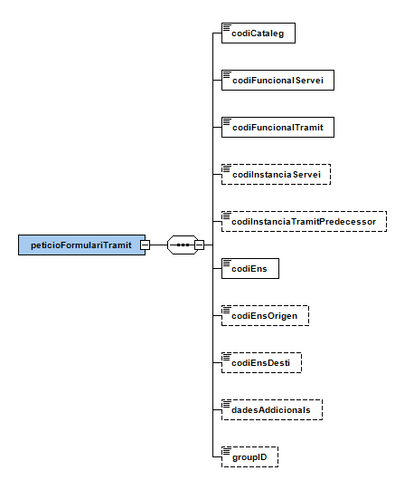

# OVER
Documentació d'integració d'OVER

# Taula de continguts

- [1. Introducció](#1-introducció)
- [2. Transmissions de dades disponibles](#2-Transmissions-de-dades-disponibles)
- [3. Missatgeria del servei](#3-Missatgeria-del-servei)
   * [3.1. Descàrrega de la documentació d'un tràmit (OVER_DOCUMENTACIO)](#31-Descàrrega-de-la-documentació-tràmit-OVER_DOCUMENTACIO)
      - [3.1.1. Petició dades específiques](#311-Petició-dades-específiques)
      - [3.1.2. Resposta dades específiques](#312-Resposta-dades-específiques)
          - [3.1.2.1. Resultat de l’operació](#3121-Resultat-de-operació)   
   * [3.2. Obtenció de formulari de tramitació (OVER_FORMULARI)](#32-Obtenció-de-formulari-de-tramitació-OVER_FORMULARI)
      - [3.2.1. Petició dades específiques](#321-Petició-dades-específiques)
      - [3.2.2. Resposta dades específiques](#322-Resposta-dades-específiques)
   * [3.3. Obtenció de context de tramitació (OVER_CONTEXT)](#33-Obtenció-de-context-de-tramitació-OVER_CONTEXT)
      - [3.3.1. Petició dades específiques](#331-Petició-dades-específiques)
      - [3.3.2. Resposta dades específiques](#332-Resposta-dades-específiques)

# 1. Introducció
Aquest document detalla la missatgeria associada al servei de l'Oficina Virtual d’Emissió i Recepció, en endavant OVER. Per poder realitzar la integració cal conèixer prèviament la següent documentació:
•	Document de Missatgeria Genèrica de la PCI del Consorci AOC.

# 2. Transmissions de dades disponibles
Les dades i operacions disponibles a través del servei són les que es presenten a continuació:

|EMISSOR|
|----|
|Consorci Administració Oberta de Catalunya|

|PRODUCTE | MODALITAT               | DESCRIPCIO|
|----     | ----------              | ----------|
|OVER     | OVER_DOCUMENTACIO       | Operació de descàrrega de documentació associada a un tràmit|
|OVER     | OVER_FORMULARI          | Operació d'obtenció del formulari de tramitació d'un tràmit|
|OVER     |	OVER_CONTEXT            | Operació d'obtenció de les dades de context d’un tràmit|
|OVER     |	OVER_TRAMITACIO         | Operació d'inici d’una instància de tràmit|
|OVER     | OVER_ACTUALITZACIO      | Operació que permet assignar informació a una instància de servei (estat, número d'expedient i altres dades)|
|OVER     |	OVER_CONSULTA           |	Consulta d'instàncies de tràmit a partir d’un rang de dates|
|OVER     | OVER_LLISTA_EXPEDIENTS  | Llista expedients de tramitacions realitzades a partir de paràmetres clau o cerca.|
|OVER     |	OVER_CONSULTA_EXPEDIENT | Consulta les tramitacions i informació relacionada sobre un expedient|
|OVER     |	OVER_LLISTA_SERVEIS     | Llista serveis funcionals a partir d'un catàleg|
|OVER     |	OVER_LLISTA_TRAMITS     | Llista tràmits funcionals a partir d’un catàleg i servei|
|OVER     |	OVER_INTEGRACIO         | Mètode de tramitació mitjançant integració sense necessitat d'omplir i manipular formularis PDF|

# 3. Missatgeria del servei
A continuació es detalla la missatgeria corresponent a les modalitats de consum del producte OVER.

## 3.1. Descàrrega de la documentació tràmit OVER_DOCUMENTACIO
Operació que permet recuperar la documentació generada en el procés de tramitació.

### 3.1.1. Petició dades específiques

  

### 3.1.2. Resposta dades específiques

  

  

#### 3.1.2.1 Resultat de operació

  

## 3.2. Obtenció de formulari de tramitació OVER_FORMULARI
Permet obtenir d’OVER la informació del formulari de tramitació d’un determinat tràmit (preompliment).

### 3.2.1. Petició dades específiques

  

### 3.2.2. Resposta dades específiques

  

## 3.3. Obtenció de context de tramitació OVER_CONTEXT
Permet obtenir d’OVER el context de tramitació d’un tràmit pel qual no es vulgui obtenir el PDF de tramitació via la modalitat OVER_FORMULARI.

### 3.3.1. Petició dades específiques

  

### 3.3.2. Resposta dades específiques

 
